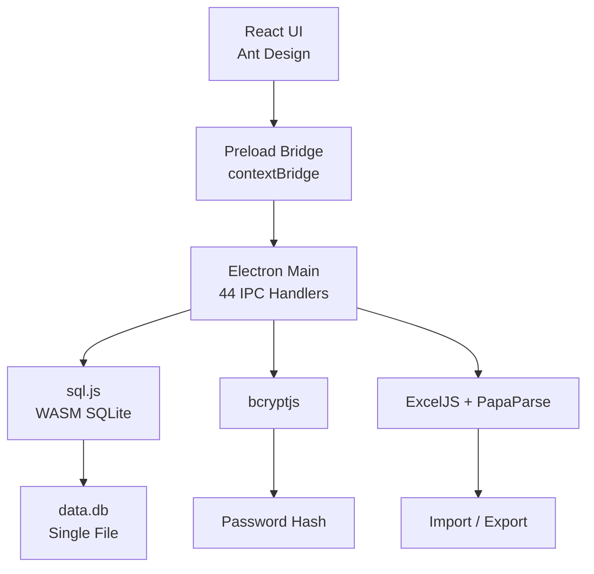
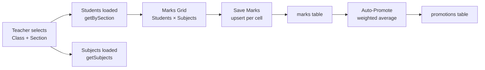

# Darj

A standalone desktop application for Indian government schools — student
enrolment, attendance, marks, promotions, and year-end rollover. Fully
offline, single `.exe` installer, all data stays on the school's computer.

<p align="center">
  
</p>

## Problem Statement

Indian government schools manage thousands of student records — admissions,
daily attendance, exam marks, year-end promotions — on paper registers.
Paper is lost, damaged, or locked in cupboards. Existing school management
software requires internet (unreliable in rural areas), annual SaaS fees,
or IT staff (unavailable). Teachers with no technical background need a
desktop app that installs like any Windows software, works offline forever,
and uses simple forms they already understand from paper registers.

## System Overview

Darj installs once on the school computer. A setup wizard collects school
details, configures classes/sections, and sets what student information to
collect. Teachers log in with a password. Everything after that — adding
students, marking attendance, entering marks, running promotions, rolling
over the academic year — happens on that single computer. A single SQLite
file holds all data. Backup is copying that file.

## Architecture



## Data Flow — Marks Entry



## Technical Stack

| Layer | Technology | Rationale |
|---|---|---|
| Desktop Shell | Electron 34 | Cross-platform, auto-updating |
| UI | React 18 + Ant Design 5 | Rich data tables, forms, i18n |
| State | Zustand 5 | Minimal boilerplate |
| Routing | React Router 7 (HashRouter) | Works with `file://` protocol |
| Database | sql.js (SQLite WASM) | Zero native deps, single file |
| Auth | bcryptjs | Salted hashing, no network |
| i18n | react-i18next | 243 keys, Hindi + English |
| Charts | Recharts 3 | Bar, line, area charts |
| Excel | ExcelJS + PapaParse | Styled export, multi-sheet import |
| Build | Vite 6 + vite-plugin-electron | Fast HMR, code splitting |
| Packaging | electron-builder (NSIS) | `.exe` installer, desktop shortcut |

## Key Engineering Features

**EAV Student Fields:** No student field is hardcoded. Schools define what
information to collect — Full Name, Father's Name, PEN Number, Aadhaar,
or custom fields like "Bus Route". Every field can be added, removed,
renamed, reordered, or marked as searchable at any time. Values are stored
in a classic Entity-Attribute-Value pattern.

**Weighted Average Promotions:** Exams are created school-wide with a weight
percentage (e.g., Half-Yearly 40%, Final 60%). Auto-Promote calculates each
student's weighted average across all exams and compares against a
configurable passing threshold. Exceptional promotions (medical, admin)
override calculated results with a mandatory reason.

**Roman Numeral Import:** Government school spreadsheets often use Roman
numerals for class names (Class I, Class II, ... Class XII). The import
system auto-detects Class + Section columns, converts I to Class 1 through
XII to Class 12, groups rows by unique class/section combinations, and
auto-creates missing classes and sections before importing students.

**Frameless Window with Hardware Acceleration:** The Electron window runs
with `frame: false`, a custom React TitleBar, and `-webkit-app-region: drag`
for window movement. Native menu bar is hidden. Window controls (min/max/
close) are rendered in React, matching the sidebar gradient.

**Migration-Tolerant Database:** Schema migrations run on every startup as
individual SQL statements wrapped in try/catch. `ALTER TABLE ADD COLUMN`
errors are silently ignored if the column already exists. The `migrateDb()`
function runs for existing databases and rebuilds tables if constraints
differ from the current schema definition — enabling upgrades without
data loss.

**Dual-Mode Export:** All exports (student data, attendance, marks, year-end
reports) are generated as professional Excel workbooks via ExcelJS with full
cell styling — merged header rows, navy/indigo column headers, alternating
row fills, gold/silver/bronze rank highlights, red rows for failed students.

## Database Schema

17 tables, 4 runtime migrations, 8 indexes.

| Table | Purpose | Key Columns |
|---|---|---|
| `schools` | Single school record | name, academic_year, uid_prefix |
| `modules` | Feature toggles | module_key (attendance/marks/promotions) |
| `classes` | Classes (1-12 + custom) | name, display_order |
| `sections` | Sections (A, B, C...) | name, class_teacher_name |
| `student_fields` | Dynamic field definitions | field_key, display_name, field_type, is_searchable |
| `students` | Student records | student_uid, status, photo |
| `student_field_values` | EAV value storage | value_text, value_date, value_number |
| `users` | Login credentials | password_hash, recovery_key_hash |
| `attendance` | Daily attendance | date, status (present/absent/late) |
| `subjects` | Subjects per class | name, passing_marks |
| `exams` | School-wide exams | name, exam_type, weight_percentage, is_completed |
| `marks` | Student marks | marks_obtained, max_marks, is_pass |
| `promotions` | Promotion history | status (promoted/failed), reason |
| `archives` | Year-end snapshots | academic_year, data_blob (JSON) |
| `settings` | Key-value config | key, value |
| `status_history` | Status change log | old_status, new_status, reason, effective_date |

## Installation & Setup

**Prerequisites**
- Windows 10 or later
- No internet connection required after install
- No admin rights required (installs to `%LOCALAPPDATA%`)

**Build from source**
```bash
git clone https://github.com/nabeelsyed14/darj.git
cd darj
npm install
npm run electron:build
# Installer at releases/Darj Setup 0.1.0.exe
```

**Run in dev mode**
```bash
npm run electron:dev
```

**Backup**
Copy `%APPDATA%\Darj\data.db` to a safe location. Restore by overwriting.

## Project Structure

```
darj/
├── package.json                     # Dependencies + electron-builder config
├── vite.config.ts                   # Vite + Electron + code splitting
├── tsconfig.json                    # TypeScript config
├── scripts/
│   ├── postbuild.js                 # Copy schema.sql, WASM, logo to dist/
│   └── create-sample.js             # Generate sample import Excel
├── assets/
│   └── logo.png                     # App icon
├── Darj_Sample_Import.xlsx          # 3-sheet sample for import testing
├── src/
│   ├── main/                        # Electron main process
│   │   ├── index.ts                 # Window creation + 44 IPC handlers + logging
│   │   ├── db/
│   │   │   ├── connection.ts        # sql.js init + migration runner + query helpers
│   │   │   ├── schema.sql           # 200 lines — 17 tables + migrations + indexes
│   │   │   └── queries/             # 13 query modules (CRUD per table)
│   │   └── security/                # password.ts, recovery.ts
│   ├── preload/index.ts             # contextBridge — typed API surface
│   └── renderer/                    # React app
│       ├── main.tsx                 # Entry — HashRouter, ConfigProvider, ErrorBoundary
│       ├── App.tsx                  # Routing — wizard → login → layout (13 routes)
│       ├── i18n/                    # en.json (243 keys) + hi.json (full Hindi)
│       ├── store/                   # 4 Zustand stores (auth, school, ui, modules)
│       ├── styles/                  # globals.css, tiles.css, animations.css, glass.css
│       └── components/
│           ├── Layout/              # Sidebar + custom TitleBar
│           ├── SetupWizard/         # 5-step first-run wizard
│           ├── Login/               # Password login + recovery
│           ├── Students/            # List, Form, Profile, Move, Import (5 components)
│           ├── Classes/             # ClassSectionManager + ClassSelector
│           ├── Attendance/          # Daily attendance sheet
│           ├── Marks/               # School-wide exam creation + marks entry
│           ├── Promotions/          # Auto-promote, weighted average, exceptional
│           ├── YearEnd/             # Rollover with ExcelJS report generation
│           ├── Analytics/           # Recharts — bar, line, area charts
│           ├── Export/              # Professional Excel export (ExcelJS)
│           ├── Settings/            # School details, modules, language, backup
│           ├── AppLogo.tsx          # Logo component with fallback
│           └── ErrorBoundary.tsx    # React error boundary
```

## Technical Challenges & Solutions

**sql.js WASM loading in packaged builds:** Vite's UMD wrapper breaks sql.js
when bundled. The solution was to mark sql.js as `external` in the Vite config,
ship the full `node_modules` in the asar, and configure `locateFile` to point
to the WASM file inside the packaged `node_modules/sql.js/dist/` path.

**HashRouter for Electron's `file://` protocol:** `BrowserRouter` uses HTML5
history API which rewrites `file:///students` — a path that doesn't exist on
disk. `HashRouter` stores the route in the URL hash (`file:///index.html#/students`)
which works reliably regardless of protocol.

**ExcelJS vs xlsx for styled exports:** The native `xlsx` library supports
cell data but not cell styles (fills, fonts, borders). Switched to `exceljs`
which provides full cell-level styling — dark red school name headers, light
indigo column headers, alternating row fills, gold/silver/bronze rank highlights.

**SQLite CHECK constraint migration:** SQLite does not support `ALTER TABLE
DROP CONSTRAINT` or `ALTER TABLE ALTER CONSTRAINT`. When new student statuses
(`on_leave`, `transferred`) were needed but the old CHECK constraint rejected
them, a `migrateDb()` function was written to detect the old constraint via
`sqlite_master`, rebuild the table without the constraint, copy all data, and
recreate indexes — all transactionally.

**Auto-Promote accidentally marking students as Exceptional:** Early versions
auto-generated a `reason` string for every auto-promoted student. The
Exceptional detection logic checked for any `reason` field — making every
auto-promoted student appear Exceptional. The fix removed auto-generated
reasons; `reason` is now only set manually by the teacher for genuine exceptions.

## Known Limitations

- **Single-user, single-machine:** One password per school. No multi-teacher
  login or concurrent access.
- **No built-in transfer certificates:** Government schools need physical
  certificates with stamps and seals. The app does not generate official documents.
- **No timetable or fee management:** By design — these features vary too widely.
- **No cloud sync:** Backup is manual — copy the `data.db` file. This is
  intentional but means the school is responsible for backup discipline.
- **ExcelJS adds ~940KB gzipped to bundle size:** Accepted trade-off for
  professional export formatting required by government schools.

## Future Improvements

- Multi-user login with role-based access (principal vs class teacher vs clerk)
- Report card generation with configurable templates for different state boards
- Bulk SMS/WhatsApp attendance notifications to parents
- Student document uploads (birth certificate, transfer certificate, caste certificate)
- Academic calendar with holiday list and exam schedule planning
- Auto-backup to USB drive on insertion

## Lessons Learned

**EAV for student fields was the right call.** Schools in different states
collect different information. Hardcoding "PEN Number" or "SR Number" would
alienate half the user base. The EAV pattern lets each school configure their
own student form — adding "Caste Category" or "Bus Route" with no code changes.

**ExcelJS is worth the bundle size.** Multiple attempts to style exports with
plain `xlsx` failed silently — data was correct but formatting never applied.
ExcelJS's cell-level API works consistently and produces output that school
administrators recognise as "official-looking".

**IPC security must be by design, not by hope.** Named handlers
(`students:create`, `attendance:mark`) rather than a generic `db:query`
endpoint mean the renderer cannot execute arbitrary SQL.

**Silent errors in Electron are deadly.** `try {} catch {}` with an empty
catch block caused three separate production issues where the UI froze
or displayed stale data with no visible error. Adding `console.error`
and a debug log made debugging tractable.

## License

MIT
